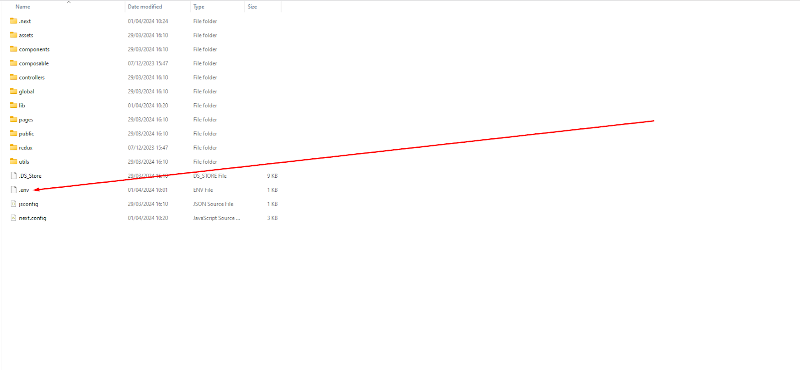
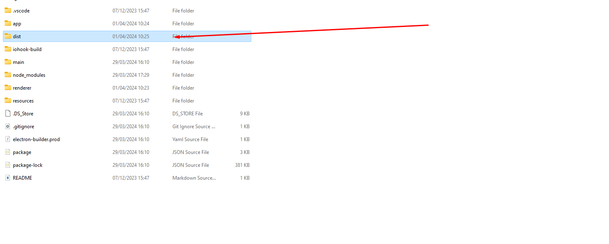
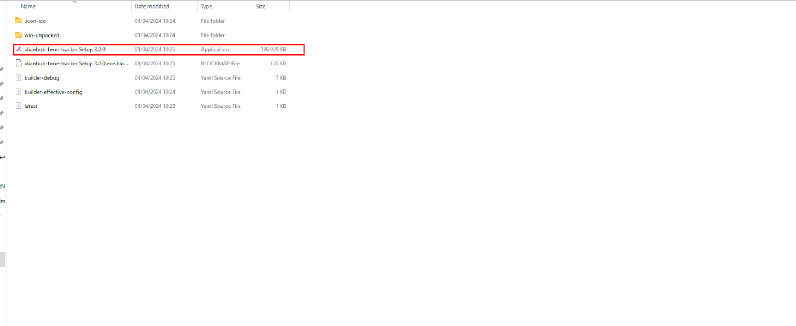

# 1. Nodejs Configuration

### 1.1 Nodejs Configuration

Kindly navigate to your project's folder.

1. You must verify that **Npm (v10.2.4)** and **Node (v20.11.1)** are installed for the relevant version. If you're not sure about the version, try to run the given command in the command prompt: <mark style="color:red;">**npm run check-version**</mark>&#x20;
2.  If both the **Node** and **Npm versions** match, then the screen will display the output as shown below:\


    <figure><figcaption></figcaption></figure>

Else, the screen will display the output as shown below:

<figure><figcaption></figcaption></figure>

Kindly check if Node is pre-installed in your system. If not, then you need to install it before running Step 1.&#x20;

### Reference to Node Installation:&#x20;

1. [_**Node.js Official Website**_](https://nodejs.org/download/release/v20.11.1/)&#x20;
2. Using NVM [_**https://github.com/nvm-sh/nvm?tab=readme-ov-file#installing-and-updating**_](https://github.com/nvm-sh/nvm?tab=readme-ov-file#installing-and-updating)

### 1.2 Vue CLI install

After the completion of node configuration you need to install the Vue cli using the following Command. Also you can refer to the [official site](https://cli.vuejs.org/guide/installation.html).

```bash
npm install -g @vue/cli
# OR
yarn global add @vue/cli
```

After installation, you will have access to the `vue` binary in your command line. You can verify that it is properly installed by simply running `vue`, which should present you with a help message listing all available commands.

You can check you have the right version with this command:

```
vue --version
```


# 2. Server Startup

### 2.1 Start Server and Installation

Go back to your command prompt after completing Step 1. Now, use the command:

<mark style="color:red;">**npm run basic-install**</mark>

NOTE: if this step thows issue related to the BUILD failure, then you can follow this steps in your terminal

```
// Considering working directory as projects root directory
> cd installation
> npm run build

// On successful build completion, change directory to root
> cd ..

// Run the server using any of the below commands
> npm run start 
// OR
> node server.js
```

This command will generate <mark style="color:red;">env</mark> files and a build for installation.

When the command is done, it will display the output on your command prompt as shown on the screen below.&#x20;

<figure><figcaption></figcaption></figure>

Thereafter, navigate to <mark style="color:blue;">**http://localhost:4000**</mark>  in your browser.


# 3. Installation Guide

Please make sure to follow through the installation guide properly without skipping any step.

[_**Please follow this document**_](https://help.alianhub.com/app-installation-and-start-guide/4.-installation-guide/4.2-mongodb-verification)


<br>
<br>
<br>


# Time Tracker Configuration

### Time Tracker Setup

1. Please make sure you have setup Alianhub before you setup time tracker. You need to verify that Npm (v10.2.4) and Node (v20.11.1) are installed for the relevant version in your system.
2. Also, make sure that you install the correct version of Python before moving forward with Time Tracker. The required version of Python is v2.7.2. Download from [_**Here**_](https://www.python.org/downloads/release/python-272)_**.**_
3. If you are generating build from mac, you must have [Xcode](https://developer.apple.com/xcode/) installed.

**Kindly check if Node is pre-installed in your system. If not, then you need to install it before running Step 1.**

**Reference to Node Installation:**&#x20;

1. [_**Node.js Official Website**_](https://nodejs.org/download/release/v20.11.1/)&#x20;
2. Using NVM [_**https://github.com/nvm-sh/nvm?tab=readme-ov-file#installing-and-updating**_](https://github.com/nvm-sh/nvm?tab=readme-ov-file#installing-and-updating)
3. After checking the node version you need to create a <mark style="color:red;">**.env**</mark> file. For creating a <mark style="color:red;">**.env**</mark> file go to the Renderer folder in your project. As shown in the image below.
4.  Then in the renderer folder create file name <mark style="color:red;">**.env**</mark>.\
    \


    <figure><figcaption></figcaption></figure>


    <figure><figcaption></figcaption></figure>

**Note:** It is necessary to add '.'  (dot in prefix in name of env variable). Make sure you add it.&#x20;

5.  In that <mark style="color:red;">**.env**</mark> file add the variables as shown below.\
    \
    <mark style="color:red;">**APIURL=**</mark>

    <mark style="color:red;">**APP\_MONGO\_APP\_ID=**</mark>

    <mark style="color:red;">**APP\_MONGO\_CONNECTION\_URI=**</mark>\
    \
    You need to insert the **APIURL**, which corresponds to the APIURL listed in your Alian hub environment file. For the values of <mark style="color:red;">**APP\_MONGO\_APP\_ID**</mark> and <mark style="color:red;">**APP\_MONGO\_CONNECTION\_URI**</mark>, use the same values as <mark style="color:red;">**MONGO\_APP\_ID**</mark> and <mark style="color:red;">**MONGODB\_URL**</mark> from your Alian hub environment file, respectively.\


6. In package.json, if you don't have credentials for certificate while generating build, it is recommended that you remove the following keys from package.json:
  
    - certificateFile
    - certificatePassword
7.  After setup of your .env file you need to generate a build for time tracker.\
    \
    First you have to install all the packages with the following command:

    Command: '**npm install' or** '**npm install --legacy-peer-deps'**

    Then to generate a build, in your root folder hit the following command according to your OS.

    Windows : '**npm run build'**

    iOS: '**npm run build:ios**'

    Linux: '**npm run build**'\

8. After generating the build redirect to the dist folder. As shown in the image below.

<figure><figcaption></figcaption></figure>

9. At dist folder application is generated and ready to install.

<figure><figcaption></figcaption></figure>

