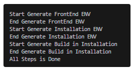

<p align="center">
  
</p>

<h3 align="center">AlianHub - Open Source Project Management System/CRM </h3>

<hr>

## Overview
Alian Hub is an open-source, project and team management platform designed to streamline workflows, improve collaboration, and give you full control over your data.

## 📸 Screenshots

<figure><figcaption></figcaption></figure>

<figure><figcaption></figcaption></figure>

<figure><figcaption></figcaption></figure>

<br/>

## Tech Stack

### Frontend
- Vue.js 3 (Composition API)
- Vue Router
- Vuex (state management)
- Custom CSS
- Axios for API communication

### Backend
- Node.js
- Express.js
- RESTful API architecture

### Database
- MongoDB

### Other Tools & Integrations
- JWT-based authentication
- Role & permission management
- Real-time features (WebSockets / polling)
- AI integrations

<br/>

## Usage / Functional Workflow

### 1. User Authentication
- Users sign up or log in to the platform
- Role-based access and permissions are applied dynamically

### 2. Dashboard Overview
- Users land on a customizable dashboard
- View project summaries, reports, and key metrics

### 3. Project Creation & Configuration
- Create new projects
- Enable or disable project-specific features
- Define milestones, sprints, statuses, and custom fields
- Assign team members with dynamic permissions

### 4. Task Management Workflow
- Create tasks, subtasks, and checklists
- Assign tasks to users
- Set priorities, due dates, and reminders
- Track progress with real-time updates
- Attach files, add comments, and tags
- Move tasks across different views (List, Board, Table, Calendar, Workload)

### 5. Task Tracking & Monitoring
- Track user activity such as screenshots, keystrokes, and mouse events
- Monitor productivity and task progress

### 6. Advanced Search & Filters
- Search tasks by project, status, assignee, creator, due date, and priority
- Save frequently used filters

### 7. Timesheets & Reports
- Log time automatically or manually
- View project, user, and workload timesheets
- Generate milestone and performance reports

### 8. Notifications & Communication
- Receive mention, email, and external notifications
- Use real-time chat and communication channels for collaboration

### 9. AI-Powered Assistance
- Generate tasks, subtasks, and checklists using AI
- Write task descriptions and project templates with AI

### 10. Administration & Permissions
- Manage roles and permissions
- Create custom roles per company
- Control access to features using dynamic permission rules

<br/>

## ✨ Key Features

### 📊 Dashboard
- Customize layouts

### 🧩 Task View
- List view
- Board view
- Table view
- Calendar view
- Workload view

### ✅ Task Management
- Track each task with:
    - screen screenshots,
    - keystrokes,
    - mouse events
- Drag-and-drop functionality
- Group-wise task views
- Create subtasks
- Create checklists
- Progress tracking
- Add tags
- Add attachments
- Due dates and reminders
- Comments
- Set priority
- Move, merge, and duplicate tasks
- Convert tasks to sprints and subtasks
- Manage tasks efficiently

### 🔍 Advanced Search Filters
- Task-wise search
- Project-wise search
- Search by due date
- Search by status
- Search by assignee
- Search by creator
- Search by priority
- Save filters

### ⏱️ Timesheet & Reports
- Project timesheet
- User timesheet
- Workload timesheet
- Tracker timesheet
- Milestone reports

### 🔔 Notifications
- Mention notifications
- External notifications
- Email notifications

### 📁 Project Management
- Enable specific features per project
- Create milestones
- Create checklists
- Set dynamic permissions
- Import and export projects
- Comments
- Workload management
- Custom field creation
- Status management
- Add assignees
- Sprint management

### 🤖 AI Integration
- Write with AI
- Create project templates using AI
- Create tasks and subtasks using AI
- Generate checklists using AI
- Write task descriptions using AI

### 🧩 Custom Fields
- Checkbox
- Dropdown
- Textarea
- Date
- Number
- Text
- Money
- Phone number
- Email

### 💬 Chat & Communication
- Real-time chat
- Create communication channels

### ⚙️ Other Features
- Multilingual support
- Local/Cloud storage support
- Pre-built project management templates
- Create custom roles and permissions

### 🌍 Built For Everyone
- Finance & Accounting
- Engineering & Product
- Marketing
- Sales & CRM
- HR & Recruiting
- IT

<br/>

## Nodejs Configuration

### 1.1 Nodejs Configuration

Kindly navigate to your project's folder.

1. You must verify that **Npm (v10.2.4)** and **Node (v20.11.1)** are installed for the relevant version. If you're not sure about the version, try to run the given command in the command prompt: <mark style="color:red;">**npm run check-version**</mark>&#x20;
2.  If both the **Node** and **Npm versions** match, then the screen will display the output as shown below:

<figure style="text-align: center;"><figcaption></figcaption></figure>

Else, the screen will display the output as shown below:

<figure style="text-align: center;"><figcaption></figcaption></figure>

Kindly check if Node is pre-installed in your system. If not, then you need to install it before running Step 1.&#x20;

### Reference to Node Installation:&#x20;

1. [_**Node.js Official Website**_](https://nodejs.org/download/release/v20.11.1/)&#x20;
2. Using NVM [_**https://github.com/nvm-sh/nvm?tab=readme-ov-file#installing-and-updating**_](https://github.com/nvm-sh/nvm?tab=readme-ov-file#installing-and-updating)

### 1.2 Vue CLI install

After the completion of node configuration you need to install the Vue cli using the following Command. Also you can refer to the [official site](https://cli.vuejs.org/guide/installation.html).

```bash
npm install -g @vue/cli
# OR
yarn global add @vue/cli
```

After installation, you will have access to the `vue` binary in your command line. You can verify that it is properly installed by simply running `vue`, which should present you with a help message listing all available commands.

You can check you have the right version with this command:

```
vue --version
```


## Server Startup

### 2.1 Start Server and Installation

Go back to your command prompt after completing Step 1. Now, use the command:

<mark style="color:red;">**npm run basic-install**</mark>

NOTE: if this step thows issue related to the BUILD failure, then you can follow this steps in your terminal

```
// Considering working directory as projects root directory
> cd installation
> npm run build

// On successful build completion, change directory to root
> cd ..

// Run the server using any of the below commands
> npm run start 
// OR
> node server.js
```

This command will generate <mark style="color:red;">env</mark> files and a build for installation.

When the command is done, it will display the output on your command prompt as shown on the screen below.&#x20;

<figure><figcaption></figcaption></figure>

Thereafter, navigate to <mark style="color:blue;">**http://localhost:4000**</mark>  in your browser.


## Installation Guide

Please make sure to follow through the installation guide properly without skipping any step.

[_**Please follow this document**_](https://help.alianhub.com/app-installation-and-start-guide/1.-nodejs-configuration)


<br>


## Time Tracker Setup Guide

### Prerequisites

Before setting up the Time Tracker, ensure that **AlianHub** is already configured on your system.

#### Required Software Versions

Please verify that the following tools are installed with the specified versions:

* [**Node.js**](https://nodejs.org/en/download)**:** v20.19.0 or higher
* **npm:** v9.6.7 or higher
* [**Python**](https://www.python.org/downloads/)**:**  v3.13.5 or higher
* [**Git**](https://git-scm.com/install/windows)**:** v2.52.0 or higher

> ⚠️ **Important:** Installing the correct Python version is mandatory before proceeding.

#### macOS Requirement

If you are generating the build on **macOS**, ensure that [**Xcode**](https://developer.apple.com/xcode/) is installed on your system.

***

### Node.js Installation

First, check whether Node.js is already installed or not in your **Git Bash** or **Command Prompt(Terminal)**:

<figure><figcaption></figcaption></figure>

```
node -v
npm -v
```

If Node.js is not installed, use one of the following methods:

* **Official Node.js Website:** [**https://nodejs.org/en/download**](https://nodejs.org/en/download)
* **Using NVM (Recommended)**\
  <https://github.com/nvm-sh/nvm?tab=readme-ov-file#installing-and-updating>

***

### Environment Configuration

After confirming the Node.js version, you must create a `.env` file.

#### Steps to Create `.env` File

Navigate to the **`time-tracker-app`** folder in the project root.

<figure><figcaption></figcaption></figure>

Now, navigate to the **`renderer`** folder.

<figure><figcaption></figcaption></figure>

Create a file named **`.env`** file inside the **`renderer`**  folder.

<figure><figcaption></figcaption></figure>

> ⚠️ **Note:**\
> The file name must start with a **dot `.`** delimiter. This is mandatory.

#### Environment Variables

Add the following variable to the `.env` file:

```
APIURL=
```

* Set the `APIURL` value based on the **API URL defined in your AlianHub environment configuration**.

***

### Installing Dependencies

After completing the environment setup, install the required packages. Open your **Git Bash** and navigate to the '**time-tracker-app**' folder path like below.

<figure><figcaption></figcaption></figure>

Run one of the following commands:

```bash
npm install
```

or (if dependency conflicts occur):

```bash
npm install --legacy-peer-deps
```

***

### Generating the Build

Once dependencies are installed, generate the build according to your operating system.

Now, just open your **package.json** file inside your **`time-tracker-app`** folder. Check below keys are exists or not. If it exists, then remove these two keys.

```
"certificateFile": "C:/mycert.pfx",
"certificatePassword": "YourPassword123"
```

Now run the command in your **Git Bash** to generate the application. If you are getting any error while generating a build. Then try using the **Command Prompt (CMD)** or **Windows PowerShell.** Make sure you perform this action with **Run as Administrator.**

<figure><figcaption></figcaption></figure>

#### Build Commands

* **Windows**

  ```bash
  npm run build
  ```
* **macOS (iOS build)**

  ```bash
  npm run build:ios
  ```
* **Linux**

  ```bash
  npm run build
  ```

***

### Build Output

After the build process completes:

Navigate to the **`dist`** A folder that is generated in your **`time-tracker-app`**  root directory.

<figure><figcaption></figcaption></figure>

The application will be generated inside this folder.

<figure><figcaption></figcaption></figure>

The Time Tracker application is now **ready for installation**.

</br>

## Contribution Guidelines
Thank you for considering contributing to this project!
We welcome contributions that help improve features, fix bugs, enhance performance, or improve documentation.

### How to Contribute
#### 1. Fork the Repository
- Fork the repository to your GitHub account
- Clone your fork locally

#### 2. Create a Branch
- Create a new branch for your feature or fix:
- `feature/your-feature-name`
- `bugfix/issue-description`

#### 3. Install Dependencies
- Install frontend and backend dependencies separately
- Ensure MongoDB is running locally or configured correctly

#### 4. Make Your Changes
- Follow existing project structure and coding standards
- Keep changes focused and minimal
- Add comments where necessary for clarity
- Ensure your code does not break existing functionality

#### 5. Test Your Changes
- Test frontend functionality in the browser
- Test backend APIs using Postman or similar tools
- Verify database changes carefully

#### 6. Commit Your Changes
Write clear and meaningful commit messages:
- `feat: add task priority filter`
- `fix: resolve task status update issue`
- `docs: update README usage section`

#### 7. Push & Open a Pull Request
- Push your branch to your fork
- Open a Pull Request (PR) to the main branch
- Clearly describe:
  - What you changed
  - Why the change is needed
  - Any related issues


## Coding Standards

#### Frontend (Vue 3)
- Use Vue 3 Composition API
- Keep components modular and reusable
- Use meaningful variable and component names
- Avoid unnecessary re-renders

#### Backend (Node.js)
- Follow REST API best practices
- Keep controllers, services, and routes separated
- Validate request data properly
- Handle errors consistently

#### Database (MongoDB)
- Keep schemas clean and well-structured
- Avoid breaking changes without discussion
- Use proper indexing when required


## Feature Requests
For new features:
- Explain the use case clearly
- Describe expected behavior
- Provide mockups or examples if available


## Reporting Bugs
If you find a bug:
- Check existing issues first
- Provide clear steps to reproduce
- Include screenshots or logs if possible


## Communities
Join our community to ask questions, share ideas, and collaborate with other contributors.
- **GitHub Discussions** – Feature ideas, questions, and announcements
- **GitHub Issues** – Bug reports and feature requests
- Community contributions are always welcome


## Author
**Alian Software**

Alian Software is a technology-driven company focused on building scalable, secure, and innovative digital solutions. We specialize in modern web applications, SaaS platforms, and enterprise-grade systems using cutting-edge technologies.

- Expertise in Full-Stack Development
- SaaS & Product Engineering
- AI-Driven Solutions


🌐 **Website**: https://aliansoftware.com <br/>
📧 **Contact**: support@aliansoftware.net


## Social Media
- **LinkedIn**: https://www.linkedin.com/showcase/alian-hub
- **Facebook**: https://www.facebook.com/AlianHub
- **Instagram**: https://www.instagram.com/alian_hub


## License
This project is MIT licensed.