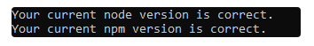

# 1. Nodejs Configuration

### 1.1 Nodejs Configuration

Kindly navigate to your project's folder.

1. You must verify that **Npm (v10.2.4)** and **Node (v20.11.1)** are installed for the relevant version. If you're not sure about the version, try to run the given command in the command prompt: <mark style="color:red;">**npm run check-version**</mark>&#x20;
2.  If both the **Node** and **Npm versions** match, then the screen will display the output as shown below:\


    <figure><figcaption></figcaption></figure>

Else, the screen will display the output as shown below:

<figure><figcaption></figcaption></figure>

Kindly check if Node is pre-installed in your system. If not, then you need to install it before running Step 1.&#x20;

### Reference to Node Installation:&#x20;

1. [_**Node.js Official Website**_](https://nodejs.org/download/release/v20.11.1/)&#x20;
2. Using NVM [_**https://github.com/nvm-sh/nvm?tab=readme-ov-file#installing-and-updating**_](https://github.com/nvm-sh/nvm?tab=readme-ov-file#installing-and-updating)

### 1.2 Vue CLI install

After the completion of node configuration you need to install the Vue cli using the following Command. Also you can refer to the [official site](https://cli.vuejs.org/guide/installation.html).

```bash
npm install -g @vue/cli
# OR
yarn global add @vue/cli
```

After installation, you will have access to the `vue` binary in your command line. You can verify that it is properly installed by simply running `vue`, which should present you with a help message listing all available commands.

You can check you have the right version with this command:

```
vue --version
```


# 2. Server Startup

### 2.1 Start Server and Installation

Go back to your command prompt after completing Step 1. Now, use the command:

<mark style="color:red;">**npm run basic-install**</mark>

NOTE: if this step thows issue related to the BUILD failure, then you can follow this steps in your terminal

```
// Considering working directory as projects root directory
> cd installation
> npm run build

// On successful build completion, change directory to root
> cd ..

// Run the server using any of the below commands
> npm run start 
// OR
> node server.js
```

This command will generate <mark style="color:red;">env</mark> files and a build for installation.

When the command is done, it will display the output on your command prompt as shown on the screen below.&#x20;

<figure><figcaption></figcaption></figure>

Thereafter, navigate to <mark style="color:blue;">**http://localhost:4000**</mark>  in your browser.


# 3. Installation Guide

Please make sure to follow through the installation guide properly without skipping any step.

[_**Please follow this document**_](https://help.alianhub.com/app-installation-and-start-guide/4.-installation-guide/4.2-mongodb-verification)


<br>
<br>
<br>


# 4. Time Tracker Setup Guide

### Prerequisites

Before setting up the Time Tracker, ensure that **AlianHub** is already configured on your system.

#### Required Software Versions

Please verify that the following tools are installed with the specified versions:

* [**Node.js**](https://nodejs.org/en/download)**:** v20.19.0 or higher
* **npm:** v9.6.7 or higher
* [**Python**](https://www.python.org/downloads/)**:**  v3.13.5 or higher
* [**Git**](https://git-scm.com/install/windows)**:** v2.52.0 or higher

> ⚠️ **Important:** Installing the correct Python version is mandatory before proceeding.

#### macOS Requirement

If you are generating the build on **macOS**, ensure that [**Xcode**](https://developer.apple.com/xcode/) is installed on your system.

***

### Node.js Installation

First, check whether Node.js is already installed or not in your **Git Bash** or **Command Prompt(Terminal)**:

<figure><figcaption></figcaption></figure>

```
node -v
npm -v
```

If Node.js is not installed, use one of the following methods:

* **Official Node.js Website:** [**https://nodejs.org/en/download**](https://nodejs.org/en/download)
* **Using NVM (Recommended)**\
  <https://github.com/nvm-sh/nvm?tab=readme-ov-file#installing-and-updating>

***

### Environment Configuration

After confirming the Node.js version, you must create a `.env` file.

#### Steps to Create `.env` File

Navigate to the **`time-tracker-app`** folder in the project root.

<figure><figcaption></figcaption></figure>

Now, navigate to the **`renderer`** folder.

<figure><figcaption></figcaption></figure>

Create a file named **`.env`** file inside the **`renderer`**  folder.

<figure><figcaption></figcaption></figure>

> ⚠️ **Note:**\
> The file name must start with a **dot `.`** delimiter. This is mandatory.

#### Environment Variables

Add the following variable to the `.env` file:

```
APIURL=
```

* Set the `APIURL` value based on the **API URL defined in your AlianHub environment configuration**.

***

### Installing Dependencies

After completing the environment setup, install the required packages. Open your **Git Bash** and navigate to the '**time-tracker-app**' folder path like below.

<figure><figcaption></figcaption></figure>

Run one of the following commands:

```bash
npm install
```

or (if dependency conflicts occur):

```bash
npm install --legacy-peer-deps
```

***

### Generating the Build

Once dependencies are installed, generate the build according to your operating system.

Now, just open your **package.json** file inside your **`time-tracker-app`** folder. Check below keys are exists or not. If it exists, then remove these two keys.

```
"certificateFile": "C:/mycert.pfx",
"certificatePassword": "YourPassword123"
```

Now run the command in your **Git Bash** to generate the application. If you are getting any error while generating a build. Then try using the **Command Prompt (CMD)** or **Windows PowerShell.** Make sure you perform this action with **Run as Administrator.**

<figure><figcaption></figcaption></figure>

#### Build Commands

* **Windows**

  ```bash
  npm run build
  ```
* **macOS (iOS build)**

  ```bash
  npm run build:ios
  ```
* **Linux**

  ```bash
  npm run build
  ```

***

### Build Output

After the build process completes:

Navigate to the **`dist`** A folder that is generated in your **`time-tracker-app`**  root directory.

<figure><figcaption></figcaption></figure>

The application will be generated inside this folder.

<figure><figcaption></figcaption></figure>

The Time Tracker application is now **ready for installation**.
